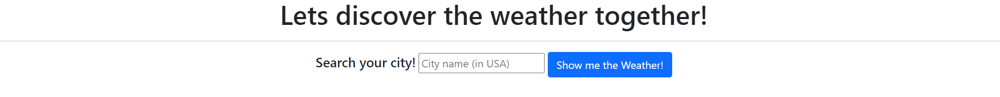
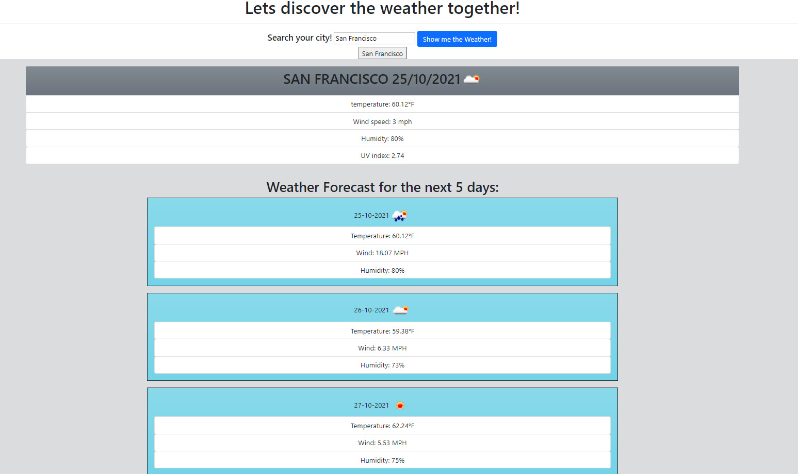

# Weather Dashboard

## About This Project

This project was intended to use third party APIs and be able to bring that information on a site. Using the OpenWeather API, I was able to practice with finding locations, and navigating the information provided by the API to customize what I wished to show on the webpage created. 

Bootstrap was used for organizing the look of the site. Creating and customizing cards to provide a user experience that is easier to navigate.

Moment.js was used to provide the date for the website, using .unix to go to epoch time (if .unix was not used the year would go to 1970s).

## Built With
- HTML
- CSS
- Javascript
- Bootstrap
- Moment.js

## Contact
Project Link: (https://cpastorelli.github.io/weather-Dashboard/)
## License

## Acknowledgements

- [moment.js](https://momentjs.com/guides/)
- [Bootstrap](https://getbootstrap.com/docs/5.1/components/card/)
- [HTMLFormElement TypeError](https://stackoverflow.com/questions/64044214/uncaught-typeerror-cannot-read-property-value-of-null-at-htmlformelement-ano)
- [Cloud Favicon](https://thenounproject.com/term/cloud/34853/)
- [Sizing cards in bootstrap](https://coreui.io/docs/utilities/sizing/)
- [Removing Class Name in JS](https://stackoverflow.com/questions/195951/how-can-i-change-an-elements-class-with-javascript)
